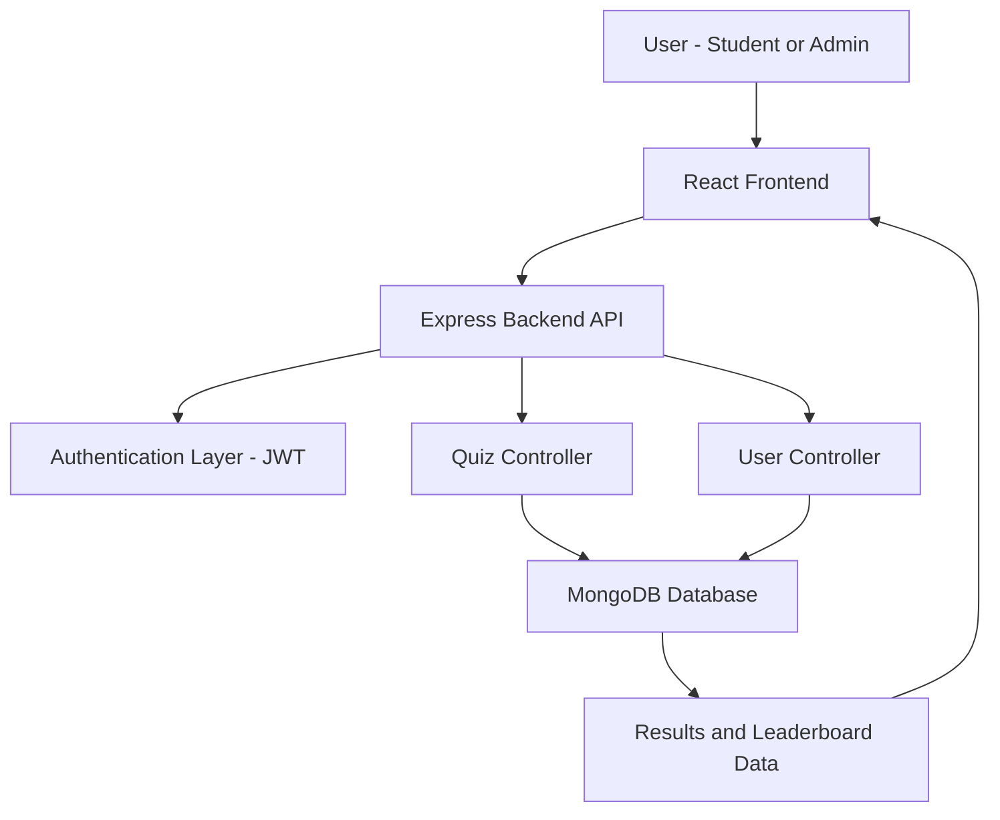

# 📚 ClassSync Quiz App

A full-stack quiz application designed for 3rd year CSE students, covering 6 core subjects with performance tracking and analytics.

---

## 🛠️ Tech Stack

- **Frontend:** React.js  
- **Backend:** Node.js, Express.js  
- **Database:** MongoDB  
- **Authentication:** JWT  

---

## 📖 Subjects Covered

1. Machine Learning  
2. Formal Language and Automata Theory  
3. Artificial Intelligence  
4. Full Stack Development  
5. Non-Conventional Power Generation  
6. Universal Human Values  

---

## ✨ Features

### 👨‍🎓 Student Features
- User registration and login  
- Subject-wise quiz access  
- Timed quizzes  
- Instant results with explanations  
- Personal performance tracking  
- Leaderboard ranking  

### 🛠️ Admin Features
- Create and manage quizzes  
- Add multiple questions per quiz  
- View analytics (average score, pass rate)  
- Monitor student performance  

---

## 🏗️ System Architecture



---

## 🚀 Installation

### Prerequisites

- Node.js  
- MongoDB (local or Atlas)  

---

### 🔧 Backend Setup

```bash
cd backend
npm install
npm run dev
```

Create `.env` file inside backend:

```
PORT=5000
MONGODB_URI=mongodb://localhost:27017/quizapp
JWT_SECRET=your_secret_key
```

---

### 🎨 Frontend Setup

```bash
cd frontend
npm install
npm start
```

---

### 🌱 Seed Database

```bash
cd backend
node seed/subjects.js
```

---

## 📖 Usage

1. Register a new account  
2. Login with credentials  
3. Select subject and take quiz  
4. View results and leaderboard  
5. Admin can create quizzes via dashboard  

---

## 🔌 API Endpoints

| Method | Endpoint | Description |
|-------|--------|------------|
| POST | /api/auth/register | Register user |
| POST | /api/auth/login | Login user |
| GET | /api/subjects | Get subjects |
| GET | /api/quizzes | Get quizzes |
| POST | /api/quizzes | Create quiz (Admin) |
| POST | /api/quizzes/:id/submit | Submit quiz |
| GET | /api/quizzes/my-results | User results |
| GET | /api/quizzes/leaderboard/:id | Leaderboard |

---

## 📁 Project Structure

```
quiz-app/
│
├── backend/
│   ├── models/
│   ├── controllers/
│   ├── routes/
│   ├── middleware/
│   └── server.js
│
└── frontend/
    ├── src/
    │   ├── components/
    │   ├── pages/
    │   ├── context/
    │   └── services/
    └── public/
```

---

## 📊 Future Improvements

- Add quiz difficulty levels  
- Implement adaptive quizzes  
- Add timer analytics  
- Improve UI/UX design  
- Deploy with Docker  

---

## 📄 License

MIT License  

---

## 📧 Contact

For queries, open an issue on GitHub.

---

⭐ Star this repo if useful
